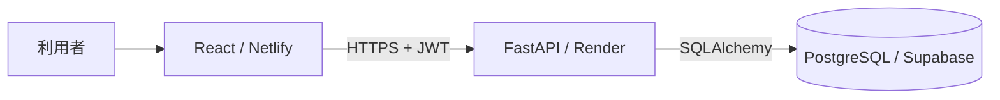

# 誰でもロードマップナレッジ

コールセンターの問い合わせ対応を、文章だけでなくロードマップ形式で整理・共有するWebアプリです。

## 主な機能

- ナレッジの検索・閲覧
- 通常形式／条件分岐を含むロードマップ形式での投稿
- 使用回数と直近7日間の利用傾向の表示
- デモモード（初期状態）：ログイン不要で全機能を体験できる
- 管理者・一般利用者のログイン（`DEMO_MODE=false` で有効化）
- アカウント作成・権限変更・停止・パスワード再設定のAPI（画面はクライアント側で実装する前提）
- API・データベース障害の表示と再試行
- 環境変数によるAPI・データベース・CORS・ログイン有無の切り替え

## デモモード（初期状態）

このリポジトリは **デモモードが初期値** です。ログインせずに全機能を確認できます。
クライアントの既存アカウント基盤と連携する時は、環境変数を2つ変えるだけでログインが有効になります。

| 場所 | 変数 | デモ | ログインあり |
| --- | --- | --- | --- |
| バックエンド | `DEMO_MODE` | `true` | `false` |
| フロントエンド | `VITE_DEMO_MODE` | `true` | `false` |

必ず両方を同じ値に揃えてください。手順の詳細は
[docs/MAINTENANCE_GUIDE.md](docs/MAINTENANCE_GUIDE.md) を参照してください。

## 権限（ログイン有効時）

| 操作 | 一般利用者 | 管理者 |
| --- | --- | --- |
| ナレッジ閲覧・検索 | ○ | ○ |
| 「この情報を使用した」の登録 | ○ | ○ |
| 投稿・編集・削除 | × | ○ |
| アカウント管理API（`/users`系） | × | ○ |

画面でボタンを隠すだけでなく、FastAPI側でも毎回権限を検査します。
デモモード中はこの権限チェックを一時的に無効化しています（コードは残したままです）。

アカウント管理の**画面**は、クライアントが既存システムに合わせて実装する想定のため
この提出版には含めていません（APIと権限の仕組みはサーバー側に揃っています）。
詳細は [docs/MAINTENANCE_GUIDE.md](docs/MAINTENANCE_GUIDE.md) を参照してください。

## システム構成



- React：利用者が操作する画面
- FastAPI：依頼の受付、本人確認、権限確認、データ処理
- PostgreSQL：ナレッジとアカウントの保存
- SQLAlchemy：Pythonとデータベースの間の翻訳・接続

詳しい初心者向け解説は [docs/ARCHITECTURE_FOR_BEGINNERS.md](docs/ARCHITECTURE_FOR_BEGINNERS.md) を参照してください。

## ローカル起動

### 1. バックエンド

```bash
cd backend
python -m venv venv
source venv/bin/activate
pip install -r requirements.txt
cp .env.example .env
```

ローカル確認だけなら、`.env`の`DATABASE_URL`を次のように変更できます。

```env
DATABASE_URL=sqlite:///./roadmap.db
CORS_ORIGINS=http://localhost:5173
JWT_SECRET_KEY=32文字以上のランダム文字列
INITIAL_ADMIN_USERNAME=admin
INITIAL_ADMIN_PASSWORD=12文字以上の初期パスワード
```

ランダムな秘密鍵の生成例：

```bash
python -c "import secrets; print(secrets.token_urlsafe(48))"
```

起動：

```bash
uvicorn main:app --reload --port 8000
```

初回管理者が作成されたら、`.env`から`INITIAL_ADMIN_PASSWORD`を削除してください。

### 2. フロントエンド

別のターミナルで実行します。

```bash
npm ci
cp .env.example .env.local
npm run dev
```

ブラウザで `http://localhost:5173` を開きます。

## 本番環境の主な設定

### Render（backendをRoot Directoryに指定）

- Build Command：`pip install -r requirements.txt`
- Start Command：`uvicorn main:app --host 0.0.0.0 --port $PORT`
- Health Check Path：`/health/live`
- 必須環境変数：`DATABASE_URL`、`CORS_ORIGINS`、`JWT_SECRET_KEY`
- 初回のみ：`INITIAL_ADMIN_USERNAME`、`INITIAL_ADMIN_PASSWORD`

### Netlify

- Build Command：`npm ci && npm run build`
- Publish Directory：`dist`
- 環境変数：`VITE_API_URL=https://あなたのRenderサービスURL`

設定後はRender側の`CORS_ORIGINS`へNetlifyの正確なURLを登録します。

## ヘルスチェック

- `/health/live`：FastAPIプロセスが起動しているか
- `/health/ready`：データベースへ実際に接続できるか

「店員が出勤しているか」と「倉庫まで商品を取りに行けるか」を分けて確認するイメージです。

## テスト

フロントエンド：

```bash
npm run lint
npm run build
```

バックエンド：

```bash
cd backend
pip install -r requirements-dev.txt
DATABASE_URL=sqlite:////tmp/roadmap_test.db \
JWT_SECRET_KEY=0123456789abcdef0123456789abcdef \
INITIAL_ADMIN_USERNAME=admin \
INITIAL_ADMIN_PASSWORD='AdminPassword123!' \
python -m pytest -q
```

## 関連資料

- [取扱説明書（保守マニュアル）](docs/MAINTENANCE_GUIDE.md)
- [現在の障害の診断・復旧手順](docs/RECOVERY_GUIDE.md)
- [クライアント向けDB・認証差し替えガイド](docs/CLIENT_HANDOFF.md)
- [初心者向けアーキテクチャ解説](docs/ARCHITECTURE_FOR_BEGINNERS.md)
- [セキュリティ上の注意](docs/SECURITY.md)
