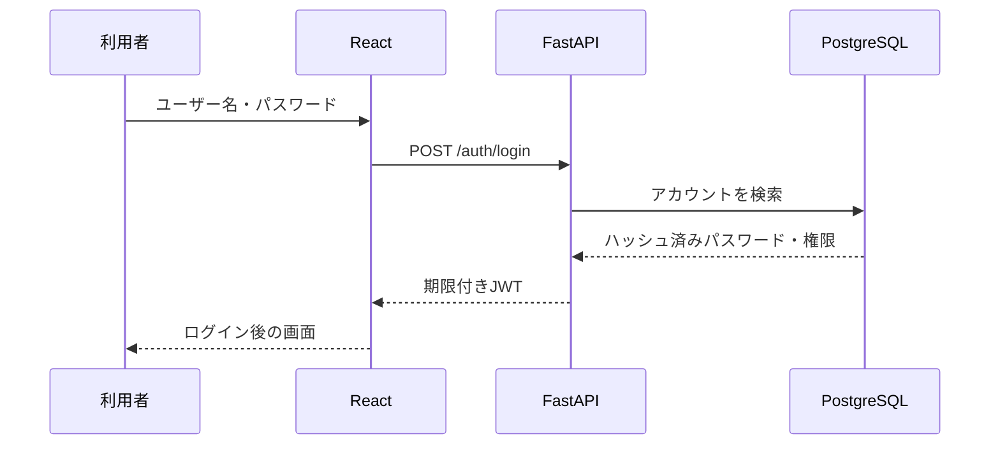

# 初心者向け：このアプリが動く仕組み

## 全体像

アプリを「図書館」に例えると、役割は次のようになります。

| 技術 | 図書館での例え | 実際の担当 |
| --- | --- | --- |
| React | 利用者が触る検索端末 | 画面表示、入力、ボタン操作 |
| FastAPI | 受付担当 | 依頼受付、本人確認、権限確認 |
| SQLAlchemy | 受付と書庫の共通伝票 | Pythonの命令をDB操作へ変換 |
| PostgreSQL | 書庫 | ナレッジとアカウントを保存 |
| Netlify | 検索端末を置く建物 | Reactをインターネット公開 |
| Render | 受付担当が働く場所 | FastAPIをインターネット公開 |
| Supabase | 書庫を提供するサービス | PostgreSQLを管理・提供 |

## ログインの流れ



JWTは「受付で発行される期限付き入館証」のイメージです。パスワードそのものを毎回送る代わりに、ログイン後は入館証をAPIへ見せます。

JWTの中身は暗号化されて見えなくなるわけではありません。署名によって改ざんを検出します。そのため、パスワードなどの秘密情報をJWTへ入れてはいけません。

## 投稿を取得する流れ

1. Reactが`GET /posts`をFastAPIへ送る
2. ReactはHTTPヘッダーにJWTを付ける
3. FastAPIがJWTとアカウントの有効状態を確認する
4. SQLAlchemyがPostgreSQLへ検索を依頼する
5. PostgreSQLがデータを返す
6. FastAPIがJSONとしてReactへ返す
7. Reactがカード一覧を描画する

## 管理者だけ投稿できる仕組み

Reactは一般利用者に投稿ボタンを表示しません。ただし、それだけでは不十分です。利用者が開発者ツールなどから直接APIへPOSTする可能性があるためです。

そこでFastAPIの投稿・編集・削除APIには`require_admin`を設定しています。

```text
画面のボタン非表示 = 操作しやすさの制御
APIの権限検査     = 本当のセキュリティ
```

## 環境変数とは

環境変数は「プログラムの外に置く設定用紙」です。

| 環境変数 | 内容 |
| --- | --- |
| `DATABASE_URL` | どのデータベースへ接続するか |
| `VITE_API_URL` | ReactがどのFastAPIへ依頼するか |
| `CORS_ORIGINS` | どの画面からの通信を許可するか |
| `JWT_SECRET_KEY` | JWTへ署名する秘密鍵 |

接続先や秘密鍵をコードへ直接書かないため、クライアント変更時にプログラムを書き換えず設定だけ変更できます。

## 主なファイル

| ファイル | 役割 |
| --- | --- |
| `src/App.jsx` | 画面、画面遷移、フォーム、権限別表示 |
| `src/api.js` | FastAPIとの通信、JWT付与、通信エラー変換 |
| `backend/main.py` | APIのURLと処理、権限別ルート |
| `backend/auth.py` | パスワード、JWT、ログイン中ユーザー確認 |
| `backend/config.py` | 環境変数の読み込み |
| `backend/database.py` | DB接続、SQLAlchemyセッション |
| `backend/models.py` | DBテーブルの設計図 |
| `backend/schemas.py` | APIで受け取る・返すデータの検査 |

## SQLAlchemyとPydanticの違い

- SQLAlchemyモデル：データベースに「どう保存するか」の設計図
- Pydanticモデル：APIで「どんな形のデータを受け取ってよいか」の検査票

同じユーザー情報でも、保管用の棚割りと受付用の申込書は別物、というイメージです。

## ヘルスチェックを2つに分けた理由

以前のコードは起動時にDB接続へ失敗すると、FastAPI自体が公開状態になりませんでした。修正版は次を分けています。

- `/health/live`：FastAPIは動いている
- `/health/ready`：DB接続までできる

これにより「受付担当が不在」なのか「受付はいるが書庫が閉まっている」のかを区別できます。
